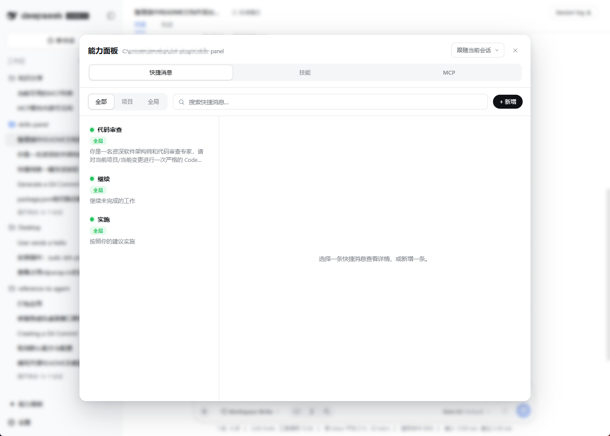
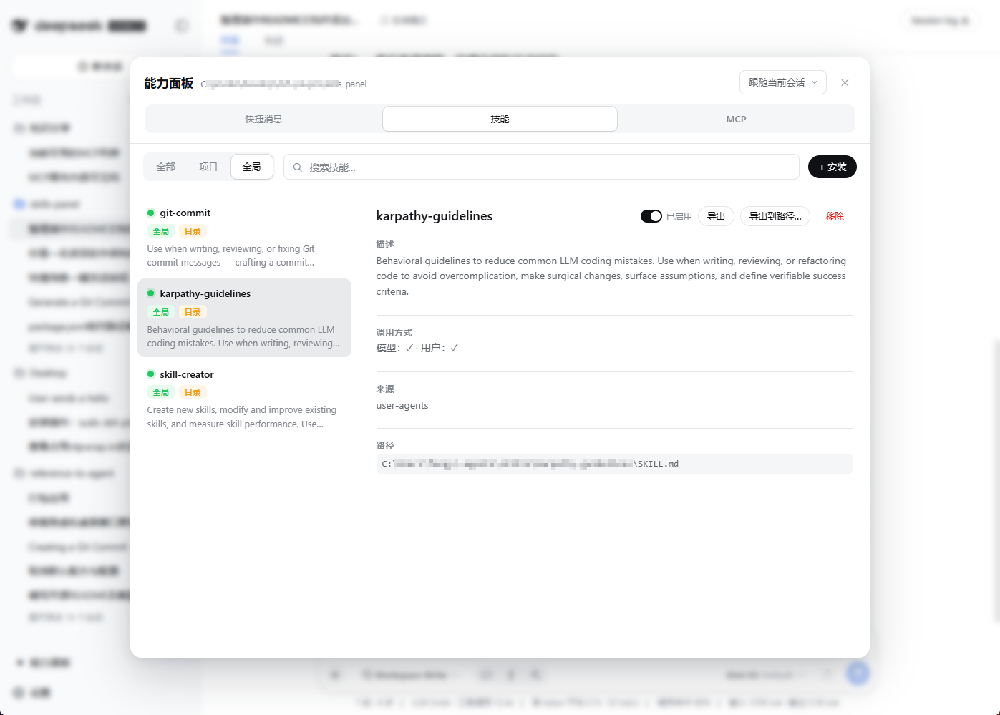
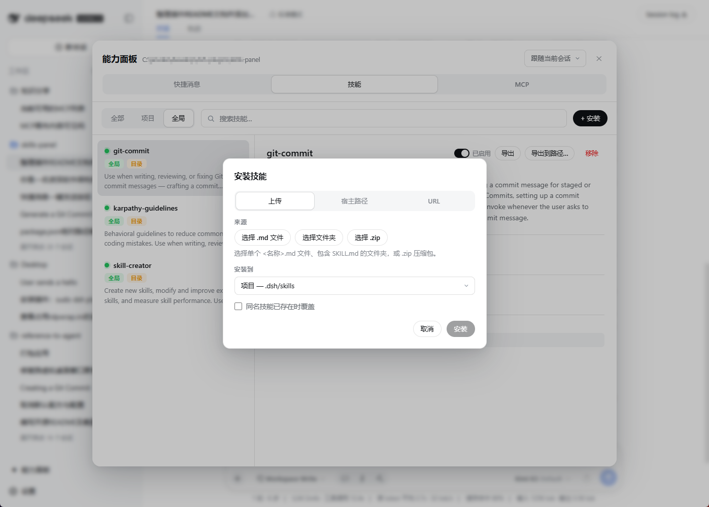
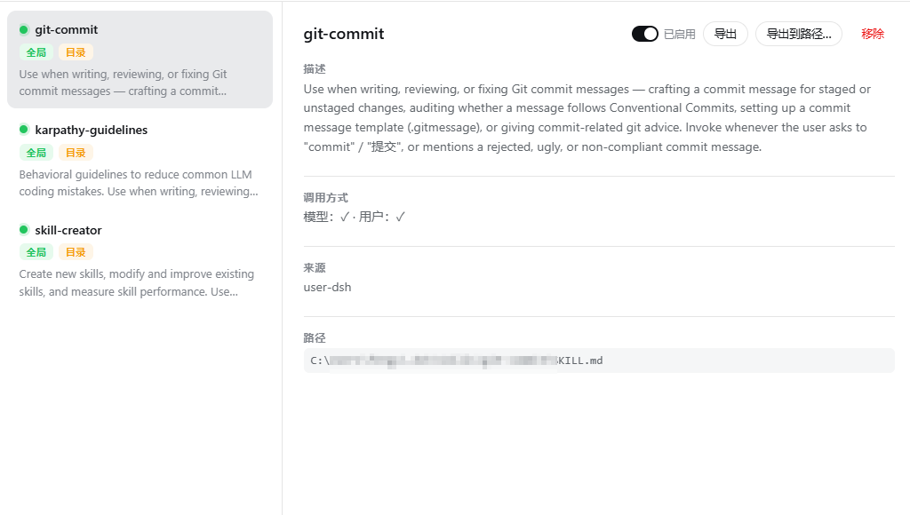
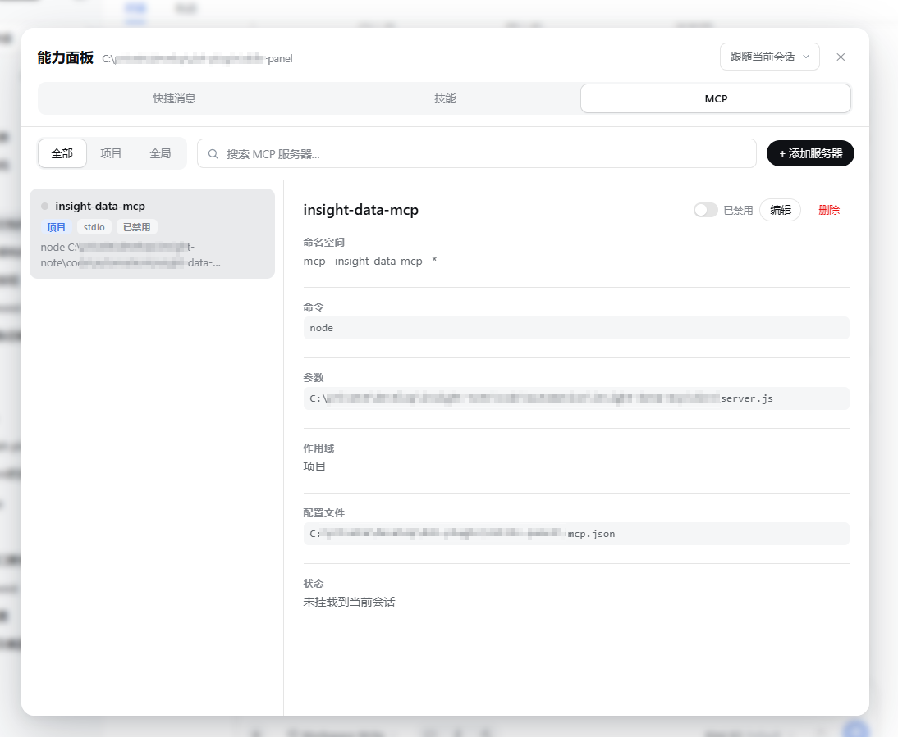
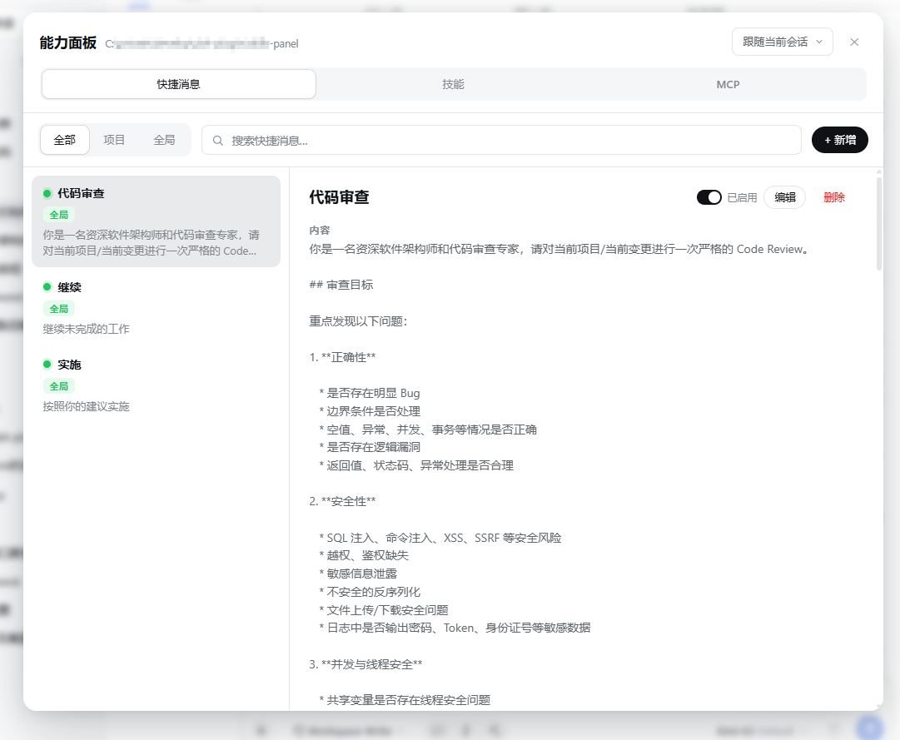
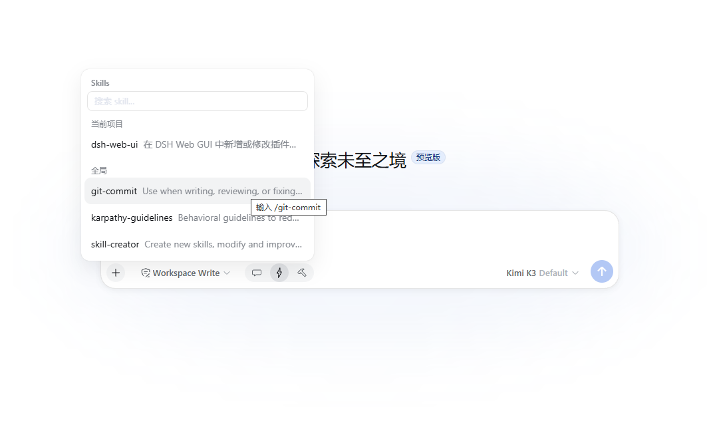
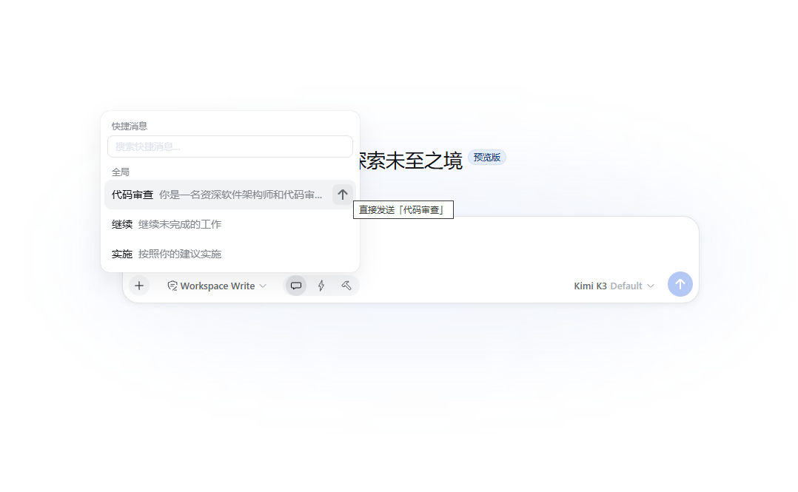
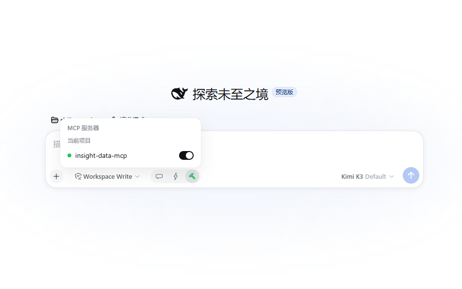

# @chengdb/capability-panel

一个 [DeepSeek Harness](https://github.com/deepseek-ai/deepseek-harness)（DSH）插件：
在 Web GUI 里**可视化管理项目的全部能力**——Skills、MCP 服务器、快捷消息，
全部支持**项目级 / 全局级**双作用域，全部可以**不离开浏览器**完成安装、启停与分发。



## 它能做什么

| 能力域 | 浏览/搜索 | 新增/安装 | 编辑 | 启用/禁用 | 删除 | 导入/导出 |
|---|---|---|---|---|---|---|
| **Skills** | ✅ 双作用域 + 详情 | ✅ 上传 / 宿主路径 / URL 三种来源 | ✅ | ✅ 一键开关 | ✅ 两击确认 | ✅ 下载 zip / 复制到宿主目录 |
| **MCP 服务器** | ✅ 双作用域 + 实时挂载状态 | ✅ 表单新增（stdio/sse/http） | ✅ | ✅ 热重挂 | ✅ | ✅ `.mcp.json` 与 Claude Code 格式兼容 |
| **快捷消息** | ✅ 双作用域 + 搜索 | ✅ 多行正文 | ✅ | ✅ | ✅ | ✅ JSON 配置文件即数据 |

## 亮点

### 🗂 一个面板，管住三个能力域

侧栏底部（Settings 旁）新增「能力面板」入口，点击弹出锚定浮层。面板顶部在
**快捷消息 / Skills / MCP** 三个域之间切换，每个域内部再按
**全部 / 项目 / 全局** 过滤，支持关键词搜索。头部下拉框还可以把"项目"
钉选到任意已知工作区——不切 session 也能管理别的项目。



### 📥 Skills：三种方式安装，一键导出分享

- **浏览器上传**：拖入单个 `.md`、整个 skill 目录、或 `.zip` 压缩包
  （浏览器端 DecompressionStream 解压，零依赖）；路径防穿越，
  200 文件 / 20MB 上限。
- **宿主路径**：把磁盘上已有的 skill 目录或 `.md` 复制进受管根。
- **URL 下载**：GitHub 仓库（`https://github.com/<owner>/<repo>`，可带
  `/tree/<branch>/<子目录>`）、任意 `.zip`、raw `.md`
  （宿主端 30MB / 30s 限速）。

压缩包/仓库归档自动剥离公共顶层目录并定位唯一 `SKILL.md`；落盘名以
frontmatter 的 `name` 为准，同名冲突报错、可选覆盖。磁盘格式与官方
filesystem provider **逐字节兼容**（flat `<name>.md` / 目录型
`<name>/SKILL.md`），装完立刻可被 agent 调用。

导出同样简单：flat skill 直接下载 `.md`，目录型 skill 在浏览器端打成
store-only zip；也可以复制到宿主任意目录。



### ⚡ 一键启用/禁用，不动正文

每个 skill 详情卡片上有「已启用 / 已禁用」开关。禁用只写入
`user-invocable: false` + `disable-model-invocation: true` 两个扁平键——
正文与其它元数据原样保留，启用即清除恢复。禁用的 skill 会立刻从输入框的
Skills 快捷弹层中消失。只读条目（custom / bundled）不显示操作按钮。



### 🔌 MCP：改配置即热挂载，不重启、不改 preset

- 配置文件与 **Claude Code 的 `.mcp.json` 格式兼容**：项目级
  `<projectRoot>/.mcp.json`，全局级 `<dshHome>/mcp.json`，同名 key
  项目级覆盖全局级；`env`/`headers`/`args` 支持 `${VAR}` 环境变量插值。
- host 插件监听 `agent/created`，把启用的 server 逐个挂进 agent 自己的
  Cordis context——工具以 `mcp__<serverName>__<tool>` 出现在**该 session
  内**，按 session 隔离，agent 销毁自动卸载。
- 面板里每次新增/编辑/删除/启停，都会**自动重挂受影响 session** 的
  MCP 连接；列表上的圆点实时显示挂载状态（绿=已挂载，黄=冲突，灰=未挂载）。



### 💬 快捷消息：常用提示词，一键入草稿、一键直发

把高频提示词存成快捷消息（项目级 `.dsh/quick-messages.json` +
全局 `<dshHome>/quick-messages.json`），面板里增删改、启停、搜索。
禁用的消息只从输入框弹层隐藏，配置仍然保留。



### ⌨️ 输入框里的「能力工具组」

输入框左下角注册了一组三个按钮（顺序与面板域 Tab 一致）：
**快捷消息 / Skills / MCP**。点击在输入框上方展开弹层，三个弹层共用
同一锚点，切换不跳位；Esc / 点击外部关闭，彼此互斥。



- **Skills 弹层**：按项目/全局分组列出 user-invocable 的 skill（可搜索），
  点击把 `/name ` 追加进草稿——与宿主 `/` 菜单同一口令形式，发送后宿主
  自动注入 skill 正文。草稿里已含已知口令时按钮实心变绿。
- **快捷消息弹层**：点击把正文追加进草稿；行尾 hover 浮现纸飞机按钮，
  **一键直发**整条消息（不经过草稿）。

  
- **MCP 弹层**：带已启用数量徽标，逐行开关直接启用/禁用 server——
  写配置文件 + 自动热重挂，与面板同一语义。

  

## 工作原理

```
浏览器客户端                          宿主（host）
┌─────────────────────┐   RPC     ┌──────────────────────────────┐
│ sidebar.footer      │ ────────► │ ctx.capabilityPanel 服务      │
│  └ 能力面板浮层      │ /capability│  ├ skills        磁盘 CRUD    │
│ conversation.input  │ -panel    │  ├ mcp           配置 CRUD +   │
│  └ 能力工具组×3      │ 通道       │  │               热挂载 loader │
│ conversation.input  │           │  └ quickMessages 配置 CRUD     │
│  └ 弹层×3            │           │ agent/created → dsh-mcp-client│
└─────────────────────┘           └──────────────────────────────┘
```

- **不重复注册 skills provider**：读取复用 `ctx.skills` 与受管根目录直读，
  与官方 filesystem provider 口径一致。
- **MCP 按 session 隔离**：挂在 agent 自己的 Cordis context 上，agent
  dispose 即自动卸载；已知限制是 `serverName` 预留为进程级，同项目两个
  session 并存时后到者显示黄色冲突圆点，不影响先挂载者。
- **UI 纯增量**：侧栏入口与输入框按钮都注册在宿主的列表槽（list slot）里，
  不顶替、不遮蔽任何内置 UI，也不绑定特定 session。

## 安装

直接从 GitHub 安装（推荐）：

```powershell
dsh plugin --profile web add "github:chengdb/dsh-plugin-capability-panel#master"
dsh web        # 打开 Web GUI，侧栏底部可见「能力面板」
```

## 本地开发

```powershell
cd <本仓库路径>
pnpm install
pnpm build     # tsc（lib/*.js + .d.ts）→ tsdown（lib/client.js 包裹版）
dsh plugin --profile web add "link:<本仓库路径>"
dsh web
```

## 目录结构

```
src/
  index.ts        宿主插件入口——暴露 ctx.capabilityPanel 服务
  client.ts       客户端插件入口（侧栏入口 + 输入框工具组 + 弹层）
  remote.ts       host↔client RPC 接线（endpoint 按域前缀路由）
  shared/         项目根探测 / 文件写锁 / skill 根定位（两域共用）
  skills/         skills 域：磁盘读写、CRUD、安装/导出、URL 下载、校验
  mcp/            MCP 域：.mcp.json 读写、agent 自动挂载、写后热重挂
  quick-messages/ 快捷消息域：JSON 配置读写、CRUD
  client/         React 面板、三个 composer 弹层、zip 工具、自含样式
```

## License

[MIT](LICENSE)
