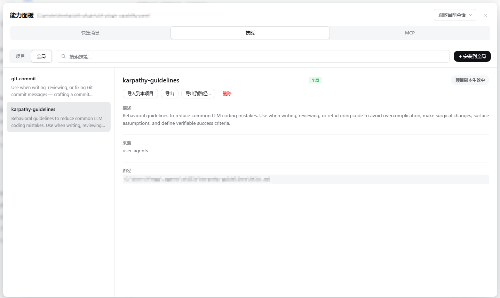

# @chengdb/capability-panel

一个 [DeepSeek Harness](https://github.com/deepseek-ai/deepseek-harness)（DSH）插件：
在 Web GUI 里**可视化管理项目的全部能力**——Skills、MCP 服务器、快捷消息，
全部支持**项目级 / 全局级**双作用域，全部可以**不离开浏览器**完成安装、启停与分发。


## 它能做什么

| 能力域 | 浏览/搜索 | 新增/安装 | 编辑 | 启用/禁用 | 删除 | 导入/导出 |
|---|---|---|---|---|---|---|
| **Skills** | ✅ 项目/全局两区 + 详情 | ✅ 上传 / 宿主路径 / URL 三种来源 | ✅ | ✅ 项目区启停 + 模型/用户方向独立开关 | ✅ 两击确认 | ✅ 导入到本项目（物理副本）/ 在本项目禁用（屏蔽占位）/ 下载 zip / 复制到宿主目录 |
| **MCP 服务器** | ✅ 项目/全局两区 + 实时挂载状态 | ✅ 表单新增（stdio/sse/http） | ✅ | ✅ 项目区启停 + 写后热重挂 | ✅ | ✅ 导入到本项目（引用，跟随全局）/ `.mcp.json` 与 Claude Code 格式兼容 |
| **快捷消息** | ✅ 项目/全局两区 + 搜索 | ✅ 多行正文 | ✅ | ✅ 项目区启停 | ✅ | ✅ 导入到本项目（引用，跟随全局）/ JSON 配置文件即数据 |

## 配置文件位置

本插件的配置文件**写入优先用 `.agents` 目录**，读取兼容旧位置与跨工具生态：

| 配置 | 写入目标 | 读取兼容（旧位置） |
|---|---|---|
| 项目级能力禁用声明（MCP 弹层「本项目」开关） | `<项目根>/.agents/capability-overrides.json` | `.dsh` → `.claude` |
| 项目级「全局能力引用」声明（MCP / 快捷消息的导入） | `<项目根>/.agents/capability-imports.json` | — |
| 项目级快捷消息 | `<项目根>/.agents/quick-messages.json` | `.dsh` → `.claude` |
| 全局 MCP 服务器 | `~/.agents/mcp.json` | `~/.dsh` → `~/.claude` |
| 全局快捷消息 | `~/.agents/quick-messages.json` | `~/.dsh` → `~/.claude` |
| Skills（项目/全局） | `.agents/skills`、`~/.agents/skills` | `.dsh/skills`（可写）、`.claude/skills`（只读展示） |
| 项目 MCP 服务器 | `<项目根>/.mcp.json`（Claude Code 标准，位置不变） | — |

首次写入新位置时，旧文件内容会自动**并入并删除**（不丢配置、不留两份）。
`.agents` 与 `.dsh` 同时参与"项目根"判定（`.claude` 也纳入），换目录 / 换
工具搬家都不会影响配置归属。

## 亮点

### 🗂 一个面板，管住三个能力域

侧栏底部（Settings 旁）新增「能力面板」入口，点击弹出锚定浮层。面板顶部在
**快捷消息 / Skills / MCP** 三个域之间切换，每个域内部再按 **项目 / 全局**
两区分离——项目区只列本项目配置里的条目，全局区只列全局配置，两区都支持
关键词搜索。头部下拉框还可以把"项目"钉选到任意已知工作区——不切 session
也能管理别的项目。


### 📥 Skills：三种方式安装，一键导出分享

- **浏览器上传**：拖入单个 `.md`、整个 skill 目录、或 `.zip` 压缩包
  （浏览器端 DecompressionStream 解压，零依赖）；路径防穿越，
  200 文件 / 20MB 上限。
- **宿主路径**：把磁盘上已有的 skill 目录或 `.md` 复制进受管根。
- **URL 下载**：GitHub 仓库（`https://github.com/<owner>/<repo>`，可带
  `/tree/<branch>/<子目录>`）、任意 `.zip`、raw `.md`
  （宿主端 30MB / 30s 限速）。

压缩包/仓库归档自动剥离公共顶层目录并定位唯一 `SKILL.md`；落盘名以
frontmatter 的 `name` 为准，同名冲突报错、可选覆盖。磁盘格式与官方
filesystem provider **逐字节兼容**（flat `<name>.md` / 目录型
`<name>/SKILL.md`），装完立刻可被 agent 调用。安装目标随所在区固定：
项目区只装进项目根，全局区只装进全局根。

导出同样简单：flat skill 直接下载 `.md`，目录型 skill 在浏览器端打成
store-only zip；也可以复制到宿主任意目录。


### ⚡ 一键启用/禁用，不动正文（仅项目区）

**全局区没有启停也没有调用方向开关**——全局技能恒定可用（对所有项目可见、
agent 可直接调用），面板在全局区提供的是「导入到本项目」「在本项目禁用 /
恢复」、导出与删除（见下一节）。**启用/禁用只发生在项目区**。

项目区详情卡上有「已启用 / 已禁用」状态按钮（文字与颜色随状态变化）。
禁用只写入 `user-invocable: false` + `disable-model-invocation: true`
两个扁平键——正文与其它元数据原样保留，启用即清除恢复。禁用的 skill 会
立刻从输入框的 Skills 快捷弹层中消失。只读条目（`.claude` 兼容根）不显示
操作按钮。

调用方式可以**按方向细调**：详情卡的「调用方式」字段上，「模型调用」与
「用户调用」两个方向各自独立开关——比如某个 skill 只希望用户 `/name`
手动触发、**不需要 agent 自动注入**，关掉「模型调用」即可，frontmatter
只写入 `disable-model-invocation: true`，`user-invocable` 原样保留
（反之亦然）。两个方向都关等价于一键禁用，恢复同理；写盘保持最小化，
启用即清除对应键。两个方向状态不一致时，整体按钮显示「部分禁用」。

左侧列表行不堆文字标签：**项目区行只保留状态圆点**（绿=双开、蓝=部分
禁用、灰=全禁用；屏蔽占位恒灰），全局区行没有圆点（全局技能恒定可用），
布局 / 来源等属性信息收进右侧详情卡。


### 🗃 Skills：全局与项目两区分离，项目级控制落实为真实文件

面板的 Skills 域分「**项目** / **全局**」两区（域内顶部切换），每区只列
该作用域的真实文件——项目区 = `<项目>/.agents/skills` 等，全局区 =
`~/.agents/skills` 等。项目级控制全部落实为项目区里的**真实文件**（副本
或屏蔽占位），启停只写 skill 文件自己的 frontmatter，由宿主的文件
watcher + 目录重发布原生生效（下一步即注入/剔除），没有写在插件私有
配置里的叠层状态。

- **导入到本项目**：全局区任意条目的详情卡上有「导入到本项目」按钮，把
  该 skill（目录型连资源）**物理复制**到 `<项目>/.agents/skills`，此后在
  本项目对这份副本的一切控制都是项目级的——宿主 registry 同名时项目优先，
  项目副本会遮蔽全局名。导入是**快照**：全局后续更新不会同步到已导入的
  副本，项目内同名冲突可选覆盖；
- **在本项目禁用 / 恢复**（shadow stub 屏蔽占位）：全局区条目的详情卡上有
  「在本项目禁用」按钮，在项目 `.agents/skills` 生成一个同名占位文件
  （frontmatter 双向禁用 + `metadata: capability-panel: shadow-stub` 标记）。
  宿主按 frontmatter name 合并技能、项目根 rank 恒高于全局根，占位文件于是
  **顶掉**同名全局条目——catalog 注入、`skill` 工具调用、`/name` 用户注入
  三条链路都在本项目内被宿主原生拒绝（其它项目不受影响）。占位条目出现在
  项目区（灰点 +「屏蔽占位」徽标），被遮蔽的全局条目在全局区带「本项目已
  禁用」徽标；点「在本项目恢复」（或删除占位文件）即还原；
- 详情卡标题旁有**归属徽标**（按作用域着色：项目=蓝 / 全局=绿）与状态徽标
  （屏蔽占位 / 本项目已禁用 / 项目副本生效中）；
- 删除按钮语义直接：全局区条目 = 「**删除**」（已导入到各项目的副本不受
  影响），项目区条目 = 「**删除**」（只删本项目这份文件；对屏蔽占位而言
  即恢复同名全局技能）；
- 提醒：**agent 侧的可见性以宿主 registry 为准**——全局 skill 对所有项目
  可见、agent 可直接调用。要让某全局 skill 在本项目停掉 agent 自动触发，
  两条路：**「在本项目禁用」**（整体屏蔽，最省事），或**先「导入到本项目」，
  再在项目区关闭它的「模型调用」**（保留 `/name` 手动调用的细粒度控制）。



### 🔌 MCP：改配置即热挂载，不重启、不改 preset

- 配置文件与 **Claude Code 的 `.mcp.json` 格式兼容**：项目级
  `<projectRoot>/.mcp.json`，全局级 `~/.agents/mcp.json`（读取兼容旧位置
  `~/.dsh/mcp.json`），同名 key 项目级覆盖全局级；`env`/`headers`/`args`
  支持 `${VAR}` 环境变量插值。
- host 插件监听 `agent/created`，把启用的 server 逐个挂进 agent 自己的
  Cordis context——工具以 `mcp__<serverName>__<tool>` 出现在**该 session
  内**，按 session 隔离，agent 销毁自动卸载。
- 面板分「项目 / 全局」两区：项目区条目可启停/编辑/删除，全局区条目提供
  **「导入到本项目」**——登记一条**引用**（写入
  `<项目根>/.agents/capability-imports.json`），不是物理复制：内容始终
  跟随全局条目（全局更新实时生效），启停是引用上的项目级标记；引用在
  项目区显示（归属徽标「全局」），可启停、可「移出」。引用与项目原生
  条目同级参与挂载合并，同名时遮蔽全局原版。
- 面板里每次新增/编辑/删除/启停，都会**自动重挂受影响 session** 的
  MCP 连接；项目区行的列表圆点：绿=启用、灰=禁用；挂载失败/冲突/未挂载
  等实时状态用行内标签与 tooltip 呈现，详情卡「状态」字段保留完整挂载
  信息与错误。


### 💬 快捷消息：常用提示词，一键入草稿、一键直发

把高频提示词存成快捷消息（项目级 `<项目根>/.agents/quick-messages.json` +
全局 `~/.agents/quick-messages.json`，读取兼容旧位置 `.dsh` / `~/.dsh`）。
面板分「项目 / 全局」两区管理：项目区条目可增删改、启停、搜索；全局区
条目的**「导入到本项目」**登记一条引用（写入
`.agents/capability-imports.json`）——内容始终跟随全局（全局更新实时
生效），启停是引用上的项目级标记，可随时「移出」。
禁用的消息只从输入框弹层隐藏，配置仍然保留。


### 🎯 项目级控制全局能力

全局能力默认对所有项目生效。想只在某个项目里调整，每个域都有落在真实
文件上的机制（都不写插件私有的叠层状态）：

- **Skills**：「导入到本项目」物理复制出项目副本（此后项目内独立启停 /
  细调方向，快照不跟随全局）；或「在本项目禁用」生成屏蔽占位（shadow
  stub，整体屏蔽，删除即恢复）；
- **MCP / 快捷消息**：「导入到本项目」登记**引用**（内容实时跟随全局，
  启停是引用上的项目级标记，写在 `.agents/capability-imports.json`）；
- **MCP 弹层的「本项目」开关**：输入框的 MCP 弹层里，全局 server 可以
  直接切换本项目启用/禁用（写 `.agents/capability-overrides.json`，
  本项目的 session 热卸载/重挂，不动全局配置，其他项目不受影响）。

### ⌨️ 输入框里的「能力工具组」

输入框左下角注册了一组三个按钮（顺序与面板域 Tab 一致）：
**快捷消息 / Skills / MCP**。点击在输入框上方展开弹层，三个弹层共用
同一锚点，切换不跳位；Esc / 点击外部关闭，彼此互斥。


- **Skills 弹层**：按项目/全局分组列出 user-invocable 的 skill（可搜索），
  同名 skill 以项目区条目为准（与宿主 rank 解析同一口径，被项目副本 /
  屏蔽占位遮蔽的名字不会漏出全局的"死口令"）。点击把 `/name ` 追加进
  草稿——与宿主 `/` 菜单同一口令形式，发送后宿主自动注入 skill 正文。
  草稿里已含已知口令时按钮实心变绿。
- **快捷消息弹层**：点击把正文追加进草稿；行尾 hover 浮现纸飞机按钮，
  **一键直发**整条消息（不经过草稿）。被项目区同名条目（原生或引用）
  遮蔽的全局消息不重复出现。

  
- **MCP 弹层**：逐行开关控制 server 的**本项目启用/禁用**——项目条目
  （含引用）直接切项目级状态，全局条目走项目级覆写（不翻全局配置，其他
  项目不受影响），全局已禁用的 server 不在此列出（启用全局请到能力面板
  全局区）；写配置 + 自动热重挂，与面板同一语义。

  

## 工作原理

```
浏览器客户端                          宿主（host）
┌─────────────────────┐   RPC     ┌──────────────────────────────┐
│ sidebar.footer      │ ────────► │ ctx.capabilityPanel 服务      │
│  └ 能力面板浮层      │ /capability│  ├ skills        磁盘 CRUD    │
│ conversation.input  │ -panel    │  ├ mcp           配置 CRUD +   │
│  └ 能力工具组×3      │ 通道       │  │               热挂载 loader │
│ conversation.input  │           │  ├ quickMessages 配置 CRUD     │
│  └ 弹层×3            │           │  ├ overrides 项目级禁用声明    │
└─────────────────────┘           │  └ imports   项目级引用声明    │
                                  │ agent/created → dsh-mcp-client│
                                  └──────────────────────────────┘
```

- **不重复注册 skills provider**：面板列表直接读受管根目录的磁盘（与官方
  filesystem provider 口径逐字节一致），启停只写 frontmatter 调用键，
  由宿主的文件 watcher 原生生效。
- **MCP 按 session 隔离**：挂在 agent 自己的 Cordis context 上，agent
  dispose 即自动卸载；已知限制是 `serverName` 预留为进程级，同项目两个
  session 并存时后到者显示黄色冲突圆点，不影响先挂载者。
- **UI 纯增量**：侧栏入口与输入框按钮都注册在宿主的列表槽（list slot）里，
  不顶替、不遮蔽任何内置 UI，也不绑定特定 session。

## 安装

安装最新 release（推荐，版本钉死）：

```powershell
dsh plugin --profile web add "github:chengdb/dsh-plugin-capability-panel#v0.8.0"
dsh web        # 打开 Web GUI，侧栏底部可见「能力面板」
```

跟随 `master` 最新代码（无 release 时可临时用）：

```powershell
dsh plugin --profile web add "github:chengdb/dsh-plugin-capability-panel#master"
```

## 卸载

```powershell
dsh plugin --profile web remove @chengdb/capability-panel
```

移除后重新运行 `dsh web` 即可，侧栏入口与输入框工具组随之消失。卸载**不会**触碰
你已经管理的任何数据——`.agents/skills`（及旧位置 `.dsh/skills`）、`.mcp.json`、
`quick-messages.json`、`capability-imports.json` 等文件全部原样保留，随时可重新
安装接管。

## 本地开发

```powershell
cd <本仓库路径>
pnpm install
pnpm build     # tsc（lib/*.js + .d.ts）→ tsdown（lib/client.js 包裹版）
dsh plugin --profile web add "link:<本仓库路径>"
dsh web
```

## 目录结构

```
src/
  index.ts        宿主插件入口——暴露 ctx.capabilityPanel 服务
  client.ts       客户端插件入口（侧栏入口 + 输入框工具组 + 弹层）
  remote.ts       host↔client RPC 接线（endpoint 按域前缀路由）
  shared/         项目根探测 / 文件写锁 / skill 根定位与来源分类（两端共用）
  skills/         skills 域：磁盘读写、CRUD、安装/导出、URL 下载、shadow stub、校验
  mcp/            MCP 域：.mcp.json 读写、agent 自动挂载、写后热重挂
  quick-messages/ 快捷消息域：JSON 配置读写、CRUD
  overrides/      项目级禁用声明：.agents/capability-overrides.json 读写（兼容旧位置）
  imports/        项目级「全局能力引用」：.agents/capability-imports.json 读写（MCP / 快捷消息）
  client/         React 面板（三域两区）、三个 composer 弹层、zip 工具、自含样式
```

## License

[MIT](LICENSE)
